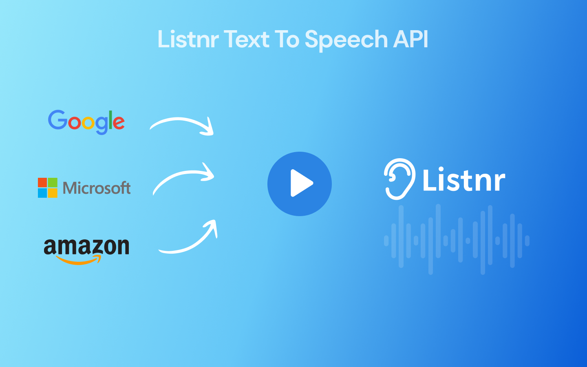

# Listnr Text-to-Speech API


Access all the best text-to-speech AI voices from Google, Amazon, IBM and Microsoft using Listnr'S text-to-speech API. Our [AI voice generator](https://voices.listnr.tech) provides a single interface to convert text to audio using voices across different providers. 

Using a single text-to-speech API in your projects saves you time and offers many benefits:
1. You instantly get access to all the voices from Google, Amazon, IBM and Microsoft.
2. You maintain only one API integration.
3. You don't have to worry about API upgrades or changes made on Google, Amazon, IBM and Microsoft.
4. Any new voices added on these platforms are instantly available to you.

## Voices
Take a look at the at [voices.listnr.tech/voices](https://voices.listnr.tech/voices) to see all the voices available on Listnr. There you will also find the Voice Identifier, which needs to be passed to the API, when using it.

**Note:** You need to have a Listnr Voices account with word credit to be able to access the API.

## Overview of API

Endpoint which is currently available in the API that you will use to convert text to speech:
1. `/convert-text`: Performs the text-to-speech conversion.
<!-- 2. `/convert-article`: Performs the text-to-speech conversion on an article. Given an URL. -->
<!-- 2. `/voices`: Returns a list of available voices. -->
<!-- 3. `/languages`: Returns a list of available languages. -->

<!-- 2. `/articleStatus`: Lets you know if the conversion is done. -->

<!-- Since the text-to-speech conversion is an asynchronous process, you will first make a `POST` request to the `/convert` endpoint with the text and voice, and then make `GET` requests to the `/articleStatus` endpoint to check if the conversion is done and to get the audio file. -->

<!-- The two endpoints have been described in detail below. -->

<!-- But first, we need authentication! -->

## Authentication

All endpoints require authentication. Authentication consists of the following required HTTPS header:
- `x-listnr-token`: This is where your API-key goes.

To get an API key, log in with your Listnr credentials, under [voices.listnr.tech/tts-api](http://voices.listnr.tech/tts-api) to generate a personal api key for you. You will need this API key in the API request through the Listnr TTS API.

Make sure to store your API-Keys privately and do not share it. Never use your API-Key in the front-end part of your app or in the browser.

## Endpoints

- Base URL: `https://bff.listnr.tech/backend/tts/v1/`

**Notes:**
- All endpoints are relative to the base URL.
- Requests should always be in JSON format, with a `Content-Type: application/json` header.

### Convert text to speech

- Endpoint:  `./convert-text`

Use this endpoint to start converting an article from text to audio.

- Method: `POST`

- Body (JSON):
  ```jsonc
  {
    "voice": string,
    "ssml": string,
    "voiceStyle": string, // Optional         
    "globalSpeed": string,    // Optional     
    "audioFormat": string, // Optional 
    "audioSampleRate": string, // Optional
    "audioKey": string, // Optional
  }
  ```

  - `voice` is the ID of the voice used to synthesize the text. Refer to the [Voices reference file](Voices.md) for more details.


    - `ssml` is a string consisting of multiple one or more paragraphs (divided by p-tags in )in SSML format. [Learn more about SSML](https://www.w3.org/TR/speech-synthesis/). Not all SSML features are supported with all voices.

  
  - `voiceStyle` is a string representing the tone and accent of the voice to read the text. Make sure the value for `voiceStyle` is supported by the voice in your request. [Voices](##Voices)

  - `globalSpeed` is a string in the format `<number>%`, where `<number>` is in the closed interval of `[20, 200]`. Use this to speed-up, or slow-down the speaking rate of the speech.

  - `audioFormat` is a string representing the format of the audio file. The supported formats are `mp3` and `wav`.

  - `audioSampleRate` is a string representing the sample rate of the audio file. The supported sample rates are  `24000`, `48000`, 

  - `audioKey` is a string representing the key of the audio file. This is used to update the same audio file.


- Response (JSON):
  ```jsonc
  {
    "success": boolean,
    "audioUrl": string,
    "audioKey": string
  }
  ```
 

Optional fields are only provided when applicable.

- Examples (cURL Request):
  ```ssml with pauses
  curl --location --request POST 'https://bff.listnr.tech/backend/tts/v1/convert-text' \
      --header 'x-listnr-token: XXXXXX-FQ5443H-QBDHPJT-SAQX84Z' \
      --header 'Content-Type: application/json' \
      --data-raw '{
        "ssml": "<speak>Could he be imagining things<break time=\"0.3s\"/><break time=\"0.75s\"/><break strength=\"x-strong\" />Just testing the new common ew common ttsRoute to test Just testing the new common ttsRoute For azure and s3 and some extra thing to test Just testing the new common ttsRoute For azure and s3 and some extra thing to test Just testing the new common ttsRoute For azure and s3 and some extra thing to test Just testing the new common ttsRoute For azure and s3 and some extra thing to test </speak>",
        "voice":"en-US-GuyNeural"
          
      }'
      

- Example in Python
  ``` Example (Python Request):
    
    import requests
    import json

    url = "https://bff.listnr.tech/backend/tts/v1/convert-text"

    payload = json.dumps({
        "ssml": "<speak>Could he be imagining things<break time=\"0.3s\"/><break time=\"0.75s\"/><break strength=\"x-strong\" />Just testing the new common ew common ttsRoute to test Just testing the new common ttsRoute For azure and s3 and some extra thing to test Just testing the new common ttsRoute For azure and s3 and some extra thing to test Just testing the new common ttsRoute For azure and s3 and some extra thing to test Just testing the new common ttsRoute For azure and s3 and some extra thing to test </speak>",
        "voice": "en-US-GuyNeural"
      })
      headers = {
        'x-listnr-token': 'XXXXXX-FQ5443H-QBDHPJT-SAQX84Z',
        'Content-Type': 'application/json'
      }

    response = requests.request("POST", url, headers=headers, data=payload)

    print(response.text)
  ```
- Example (NodeJS Request):
  ```ssml with pauses
  var request = require('request');
  var options = {
    'method': 'POST',
    'url': 'https://bff.listnr.tech/backend/tts/v1/convert-text',
    'headers': {
      'x-listnr-tts-token': '',
      'x-listnr-token': 'FEGZ3KM-FQ5443H-QBDHPJT-SAQX84Z',
      'Content-Type': 'application/json'
    },
    body: JSON.stringify({
      "ssml": "<speak>Could he be imagining things<break time=\"0.3s\"/><break time=\"0.75s\"/><break strength=\"x-strong\" />Just testing the new common ew common ttsRoute to test Just testing the new common ttsRoute For azure and s3 and some extra thing to test Just testing the new common ttsRoute For azure and s3 and some extra thing to test Just testing the new common ttsRoute For azure and s3 and some extra thing to test Just testing the new common ttsRoute For azure and s3 and some extra thing to test </speak>",
      "voice": "en-US-GuyNeural"
    })

  };
  request(options, function (error, response) {
    if (error) throw new Error(error);
    console.log(response.body);
  });
  ```
